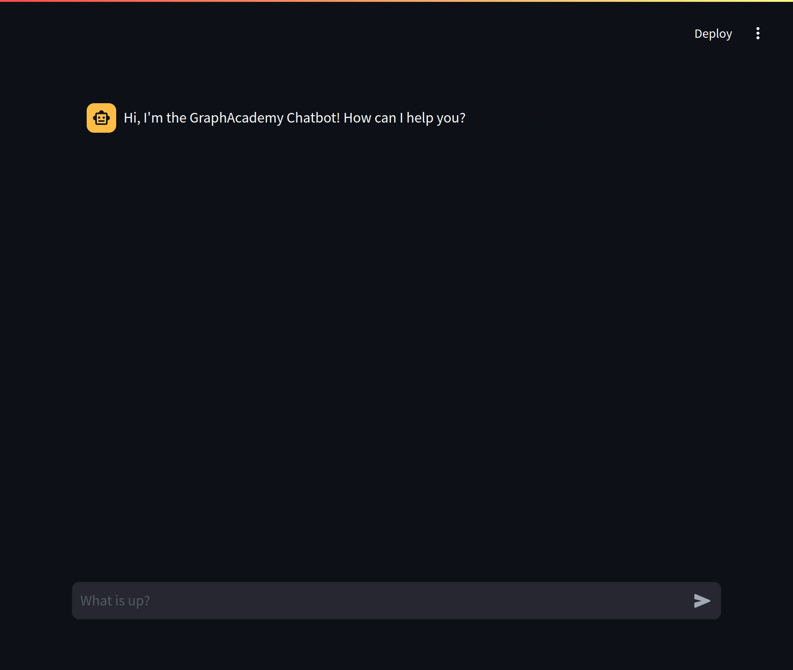

= Build an Neo4j-backed Chatbot using Python

This repository accompanies the link:https://graphacademy.neo4j.com/courses/llm-chatbot-python/?ref=github[Build an Neo4j-backed Chatbot using Python^] course on link:https://graphacademy.neo4j.com/?ref=github[Neo4j GraphAcademy^].

For a complete walkthrough of this repository, link:https://graphacademy.neo4j.com/courses/llm-chatbot-python/?ref=github[enrol now^].

== Running the application

Create the `.streamlit/secrets.toml` to place your OpenAI and Neo4j variables.
[source,toml]
OPENAI_API_KEY="sk-...."
OPENAI_MODEL="gpt-4o"
NEO4J_URI = "bolt://localhost:7687"
NEO4J_USERNAME = "neo4j"
NEO4J_PASSWORD = "password"

To run the application, you must install the libraries listed in `requirements.txt`.

[source,sh]
pip install -r requirements.txt

Then run the `streamlit run` command to start the app on link:http://localhost:8501/[http://localhost:8501/^].

[source,sh]
streamlit run bot.py        

